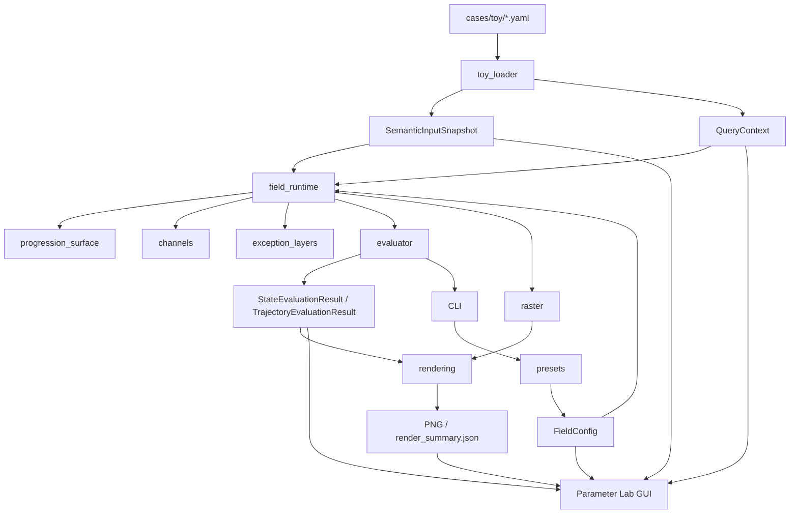

# driving-preference-field

[](https://github.com/KyunghoCha/driving-preference-field/actions/workflows/ci.yml)

source-agnostic progression semantics를 받아, 현재 보이는 local map 전체에 대해 base driving preference field를 정의하고 evaluator, raster render, Parameter Lab GUI로 시험하기 위한 연구 워크스페이스다.

canonical 핵심은 다음과 같다.

- progression field는 특정 입력원에 종속되지 않는다
- runtime은 현재 보이는 local map 전체를 평가한다
- field는 최소한 `longitudinal / progression term`과 `transverse term`을 가진다
- longitudinal과 transverse는 독립적으로 함수 family와 파라미터를 가질 수 있다
- longitudinal 좌표는 `local absolute s` 또는 `ego-relative Δs`로 읽을 수 있다
- support / confidence / continuity / alignment는 보조 성분이다
- canonical score는 `higher is better`다
- obstacle / rule / dynamic은 separate layer다

## 현재 상태

- docs-first 재시작 이후 canonical 문서 정리 완료
- tiny analytic evaluator와 toy case 지원
- local raster PNG render와 export 지원
- PyQt6 기반 Parameter Lab 초기 구현 추가
- pytest/pytest-qt 기반 최소 검증 추가
- 문서 기준 single canonical progression field 정리 완료
- 코드 / preset / GUI가 단일 canonical progression field 기준으로 정렬 완료
- current implementation을 smooth skeleton anchor blend 기반 fabric surface로 정리 진행 중
- cached runtime query layer와 progression debug component view 추가
- Parameter Lab line cut / profile inspection과 profile export 추가
- GitHub Actions CI와 git tracking 기준 정리 완료
- late Phase 4 acceptance를 semantic-first 문서/테스트 기준으로 잠그는 단계

## 아키텍처



## SSOT

- 운영 원칙 SSOT: `docs/design/engineering_operating_principles_ko.md`
- 연구 범위 SSOT: `docs/design/research_scope_ko.md`
- base field 개념 SSOT: `docs/design/base_field_foundation_ko.md`
- 입력 semantics SSOT: `docs/design/input_semantics_ko.md`
- base field 항 SSOT: `docs/design/base_field_terms_ko.md`
- layer 조합 SSOT: `docs/design/layer_composition_ko.md`
- runtime contract SSOT: `docs/design/runtime_evaluation_contract_ko.md`
- Parameter Lab 설계 SSOT: `docs/design/parameter_lab_ko.md`
- 로드맵 SSOT: `docs/status/roadmap_ko.md`
- 진행 상태 SSOT: `docs/status/project_status_ko.md`
- 실험 계획 SSOT: `docs/status/experiment_plan_ko.md`

late Phase 4 현재 목표:

- 자연 contour와 인공 artifact를 문서와 테스트에서 구분한다
- `FieldRuntime` public contract를 downstream-ready로 잠근다
- Parameter Lab export만으로 morphology 비교를 재현 가능하게 유지한다

명시적 비범위:

- 3D preview 본체화
- Source Adapter
- Gazebo / RViz / MPPI hookup

## 문서 운영 규칙

- user-facing 설계 문서는 한국어로 유지한다
- internal working note는 영어로 유지한다
- canonical 문서는 현재 정의만 직접 설명한다
- archive와 reading 자료는 canonical 정의와 분리한다
- 코드 작성 전 문서 SSOT를 먼저 고정한다
- 다른 머신에서 작업한 현재 구현 변경도 merge 전에 같은 SSOT 문서에 반영한다
- 운영체제 차이는 문서 의미가 아니라 재현 방법에서만 다룬다

## 참고 문헌 기록

- 외부 논문/글 reference log: `docs/reading/external_references_ko.md`
- archive path / source-specific reading 목록: `docs/reading/archive_references_ko.md`
- current implementation formula reference: `docs/reading/current_implementation_formula_reference_ko.md`

## 먼저 읽을 문서

1. `docs/design/engineering_operating_principles_ko.md`
2. `docs/design/research_scope_ko.md`
3. `docs/design/base_field_foundation_ko.md`
4. `docs/design/input_semantics_ko.md`
5. `docs/design/base_field_terms_ko.md`
6. `docs/design/runtime_evaluation_contract_ko.md`
7. `docs/design/parameter_lab_ko.md`
8. `docs/status/roadmap_ko.md`
9. `docs/status/project_status_ko.md`
10. `docs/status/experiment_plan_ko.md`

## 권장 실행 환경

- conda env 이름: `driving-preference-field`
- Python 버전: `3.11`
- 재현용 파일: `environment.yml`
- line ending 정책: `.gitattributes`에서 `LF`를 기본으로 고정한다

환경 준비:

1. `conda env create -f environment.yml`
2. `conda activate driving-preference-field`

크로스플랫폼 메모:

- canonical 문서, current formula, preset 의미는 Ubuntu와 Windows에서 동일해야 한다
- 이 repo는 Python/YAML/Markdown 중심이라 Windows에서도 작업 가능하지만, 의미 변경은 항상 이 repo 문서 SSOT에 같이 남긴다
- Git line ending은 `.gitattributes`를 기준으로 정규화한다

## V0 Evaluator와 시각화

이번 단계의 구현은 source-specific adapter 없이 hand-authored toy case만 지원한다.

- package: `src/driving_preference_field/`
- toy cases: `cases/toy/`
- tests: `tests/`

예시 실행:

1. `PYTHONPATH=src python -m driving_preference_field inspect-case --case cases/toy/straight_corridor.yaml`
2. `PYTHONPATH=src python -m driving_preference_field evaluate-state --case cases/toy/left_bend.yaml --x 4.7 --y 2.0 --yaw 1.0`
3. `PYTHONPATH=src python -m driving_preference_field evaluate-trajectory --case cases/toy/split_branch.yaml --trajectory '{"states":[{"x":4.6,"y":1.0,"yaw":0.55},{"x":5.3,"y":1.5,"yaw":0.55}]}'`
4. `PYTHONPATH=src python -m driving_preference_field render-case --case cases/toy/sensor_patch_open.yaml`
5. `PYTHONPATH=src python -m driving_preference_field parameter-lab --case cases/toy/straight_corridor.yaml`

렌더 출력:

- 기본 출력 디렉토리: `artifacts/render/<case_name>/`
- 각 케이스는 채널별 PNG, progression debug component PNG, hard mask, `composite_debug.png`, `render_legend.png`, `render_summary.json`을 함께 만든다

## 현재 수식 요약

아래 식들은 canonical truth가 아니라 **current implementation** 요약이다. 전체 reference는 `docs/reading/current_implementation_formula_reference_ko.md`에 둔다.

구현 경로:

- progression surface: `src/driving_preference_field/progression_surface.py`
- base channels: `src/driving_preference_field/channels.py`
- exception layers: `src/driving_preference_field/exception_layers.py`
- evaluator composition: `src/driving_preference_field/evaluator.py`

progression coordinate blend:

```math
\tau_i = \langle p - a_i,\ t_i \rangle,\quad
\nu_i = \langle p - a_i,\ n_i \rangle
```

```math
r_i = w_i^{guide} c_i \exp\left(
-\frac{1}{2}\left[\left(\frac{\tau_i}{\sigma_t}\right)^2 + \left(\frac{\nu_i}{\sigma_n}\right)^2\right]
\right),\quad
\bar{w}_i = \frac{r_i}{\sum_j r_j}
```

```math
\hat{s} = \sum_i \bar{w}_i s_i,\quad
\hat{n} = \sqrt{\sum_i \bar{w}_i \nu_i^2}
```

visible guide endpoint는 semantic start/end로 취급하지 않는다. current implementation은 양 끝에 짧은 virtual continuation anchor를 추가해 local patch 안의 fake end-cap을 줄인다.

current progression score:

```math
\text{progression\_tilted}(p) =
\text{support\_mod}\cdot\text{alignment\_mod}\cdot
\left(T(\hat{n}/\text{transverse\_scale}) + g \cdot L(u)\right)
```

base and exception composition:

```math
\text{base\_preference\_total} =
\text{progression\_tilted} + \text{interior\_boundary} + \text{continuity\_branch}
```

```math
\text{soft\_exception\_total} =
\text{safety\_soft} + \text{rule\_soft} + \text{dynamic\_soft}
```

trajectory ordering:

```math
(\text{hard\_violation\_count},\ \text{trajectory\_soft\_exception\_total},\ -\text{trajectory\_base\_preference\_total})
```

의미:

- 같은 progression slice에서는 center-high transverse profile을 먼저 본다
- stronger longitudinal에서는 farther-ahead ordering이 더 강해질 수 있다
- hard violation이 먼저 trajectory를 밀어내고, 그다음 soft burden, 그다음 higher-is-better base preference를 본다

## Parameter Lab

현재 구현된 Parameter Lab은 다음 범위를 가진다.

- case 고정
- case-level ego/window control
- baseline/candidate compare
- single / compare / diff view
- parameter Apply 기반 반영
- preset 저장 / 불러오기 / 복사
- comparison export
- fixed / normalized scale mode
- 현재 channel range / unit 표시
- 각 뷰 옆의 color scale bar 표시
- Help와 summary를 통한 current implementation guide 제공
- `s_hat`, `n_hat`, `longitudinal_component`, `transverse_component`, `support_mod`, `alignment_mod` debug view 제공
- line cut / profile inspection과 baseline/candidate/diff profile export 제공
- 기본 selected channel은 `progression_tilted`

다만 현재 GUI는 canonical 전체를 아직 다 노출하지는 않는다.

- canonical 의미는 longitudinal / transverse / support-gate 축이다
- 현재 GUI는 progression frame / longitudinal / transverse / support ceiling 축을 우선 노출한다
- interior / continuity / exception 쪽 파라미터는 아직 직접 노출하지 않는다
- current implementation formula:
  - smooth skeleton anchor를 좌표 control point로 쓰는 Gaussian-blended whole-fabric continuous function을 만든다
  - `score = support_mod * alignment_mod * (transverse_component + longitudinal_gain * longitudinal_component)`
- same-s slice에서는 center-high transverse profile을, strong longitudinal에서는 farther-ahead ordering을 먼저 확인하는 것이 맞다
- downstream runtime consumer는 `src/driving_preference_field/field_runtime.py`의 cached query layer를 기준으로 삼는다
- Phase 4 late-stage public runtime interface:
  - `build_field_runtime(snapshot, context, config=None)`
  - `FieldRuntime.query_state(state)`
  - `FieldRuntime.query_trajectory(trajectory)`
  - `FieldRuntime.query_debug_grid(x_coords, y_coords)`
- branch 사이도 winner 없이 fabric-like surface로 이어지고, raster는 이 함수를 샘플링한 visualization이다
- exact current formula는 canonical truth가 아니라 morphology 실험 대상이다

즉 현재 Parameter Lab은 **canonical progression field를 비교 실험하는 연구용 compare tool**로 읽는 것이 맞다.

이 단계에서는 geometry 편집은 하지 않는다.

## CI

- GitHub Actions workflow: `.github/workflows/ci.yml`
- 기본 job:
  - `ubuntu-latest`는 required
  - `windows-latest`는 best-effort (`continue-on-error`)로 둔다
- 테스트는 `environment.yml`로 conda environment를 만들고 `PYTHONPATH=src pytest -q`를 실행한다
